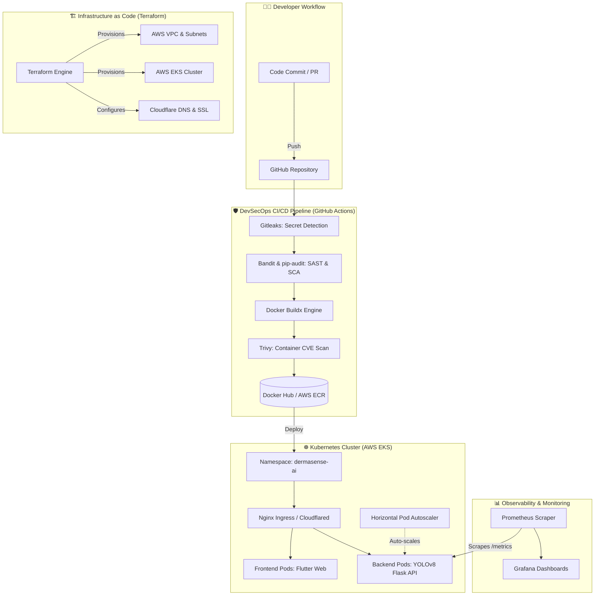

# 🩺 DermaSense AI — Production-Grade DevOps & DevSecOps Implementation

[](https://github.com)
[](https://terraform.io)
[](https://kubernetes.io)
[](https://github.com/aquasecurity/trivy)
[](https://grafana.com)
[](https://cloudflare.com)

---

## 📌 Executive Summary

**DermaSense AI** is an AI-powered dermatological analysis application leveraging **YOLOv8** computer vision models to detect and classify skin conditions in real-time. 

This repository contains the **complete, end-to-end DevOps, DevSecOps, and Cloud Engineering implementation**—transitioning an AI research codebase into a high-availability, self-healing, automated, and strictly secured enterprise cloud platform on **AWS EKS**.

---

## 🏗️ System Architecture



---

## 🚀 Key Technical Highlights

### 1. 🏗️ Infrastructure as Code (IaC) — Terraform
* **AWS VPC & Networking:** Modular subnets, Internet Gateways, NAT Gateways, and security groups.
* **AWS EKS Cluster:** Managed Kubernetes control plane with automated worker node group provisioning.
* **Automated DNS & Edge Security:** Fully automated DNS records and SSL/TLS management via the **Cloudflare Terraform Provider**.

### 2. 🛡️ Shift-Left DevSecOps Pipeline — GitHub Actions
* **Secret Scanning:** `Gitleaks` scans git history for leaked tokens, keys, and credentials on every commit.
* **SAST (Static Application Security Testing):** `Bandit` analyzes Python backend code for security antipatterns.
* **SCA (Software Composition Analysis):** `pip-audit` checks third-party dependencies against vulnerability databases.
* **Container Vulnerability Management:** `Trivy` scans built Docker container images for `CRITICAL` and `HIGH` CVEs prior to registry publish.

### 3. ☸️ Kubernetes Orchestration & Auto-scaling
* **Declarative Manifests:** Modular YAML configurations for Namespaces, Deployments, ClusterIP Services, and Ingress.
* **Horizontal Pod Autoscaler (HPA):** Dynamically scales AI inference pods based on real-time CPU and Memory loads.
* **Zero Trust & SSL:** Cloudflared tunnels and Nginx Ingress routing for automated HTTPS encryption.

### 4. 📊 Observability & MLOps Monitoring
* **Prometheus Metrics Exporter:** Custom metrics embedded inside Flask backend:
  * HTTP Request Rates (RPS per status code and endpoint).
  * YOLOv8 AI Inference Latency percentiles (**P95 vs P50**).
  * Classification counts by acne severity.
* **Custom Grafana Dashboards:** Provisioned real-time visualization dashboards for cluster health and AI telemetry.

---

## 📂 Repository Structure

```tree
├── .github/
│   └── workflows/
│       └── ci.yml               # DevSecOps CI Pipeline (Gitleaks, Bandit, Trivy, Docker Publish)
├── dermasense_ai/
│   ├── backend/                 # YOLOv8 Flask API with Prometheus metrics
│   │   ├── app.py
│   │   ├── Dockerfile
│   │   └── requirements.txt
│   └── frontend/                # Flutter web & mobile interface
│       ├── Dockerfile
│       └── lib/
├── k8s/                         # Declarative Kubernetes Manifests
│   ├── namespace.yml
│   ├── backend-deployment.yml
│   ├── frontend.yml
│   ├── service.yml
│   ├── ingress.yml
│   ├── hpa.yml                  # Horizontal Pod Autoscaler
│   └── cloudflared.yml          # Cloudflare Tunnel integration
├── monitoring/                  # Observability Stack
│   ├── prometheus/              # Prometheus scrapers & scrape configs
│   │   └── prometheus.yml
│   └── grafana/                 # Automated Grafana dashboard provisioning
│       └── provisioning/
├── terraform/                   # AWS Cloud Infrastructure
│   ├── provider.tf
│   ├── main.tf                  # VPC & Networking
│   ├── eks.tf                   # EKS Cluster & Node Groups
│   ├── cloudflare.tf            # Cloudflare DNS Automation
│   ├── variable.tf
│   └── output.tf
├── docker-compose.yml           # Full-stack local development environment
└── README.md
```

---

## ⚡ Quickstart Guide

### 🐳 Option A: Run Full Stack Locally (Docker Compose)
Spin up the backend, frontend, Prometheus, and Grafana in one command:

```bash
# Clone the repository
git clone https://github.com/<your-username>/Dearm_sence_ai_complete_devops_implementation.git
cd Dearm_sence_ai_complete_devops_implementation

# Start all services
docker compose up --build -d

# Verify running services
docker compose ps
```

* **Frontend Web App:** `http://localhost:8080`
* **Backend Healthz:** `http://localhost:5000/healthz`
* **Prometheus Dashboard:** `http://localhost:9091`
* **Grafana Observability:** `http://localhost:3001` *(Default login: `admin` / `admin`)*

---

### ☁️ Option B: Provision Cloud Infrastructure (AWS EKS via Terraform)

```bash
cd terraform

# Initialize providers
terraform init

# Review execution plan
terraform plan

# Deploy VPC, EKS Cluster, and Cloudflare records
terraform apply -auto-approve

# Connect kubectl to your new AWS EKS Cluster
aws eks update-kubeconfig --region us-east-1 --name dermasense-cluster
```

---

### ☸️ Option C: Deploy to Kubernetes Cluster

```bash
# Apply all Kubernetes manifests
kubectl apply -f k8s/

# Verify cluster status
kubectl get pods,svc,ingress,hpa -n dermasense-ai -o wide
```

---

## 🔒 Security & Quality Gates Summary

| Stage | Tool | Purpose | Status |
| :--- | :--- | :--- | :---: |
| **Secrets** | `Gitleaks` | Detect committed API tokens and credentials | ✅ Passed |
| **SAST** | `Bandit` | Python static code security scanning | ✅ Passed |
| **SCA** | `pip-audit` | Python dependency CVE audit | ✅ Passed |
| **Container** | `Trivy` | OS package & container layer vulnerability scanning | ✅ Passed |
| **TLS/SSL** | `Cloudflare` | End-to-end edge HTTPS termination | ✅ Active |

---

## 🤝 Authors & Acknowledgments
* **DevOps & Cloud Architecture:** Complete DevOps lifecycle implementation by **Hanzla**.
* **AI & Frontend Core:** DermaSense AI Final Year Project (FYP) Team.
